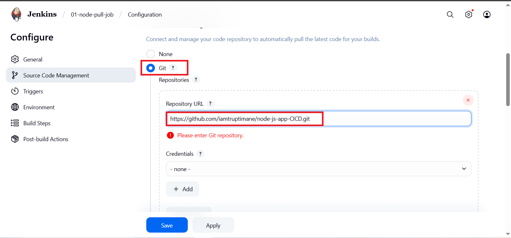
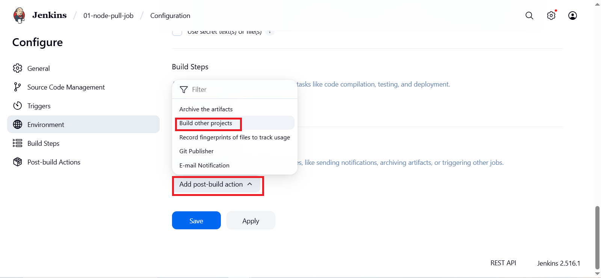
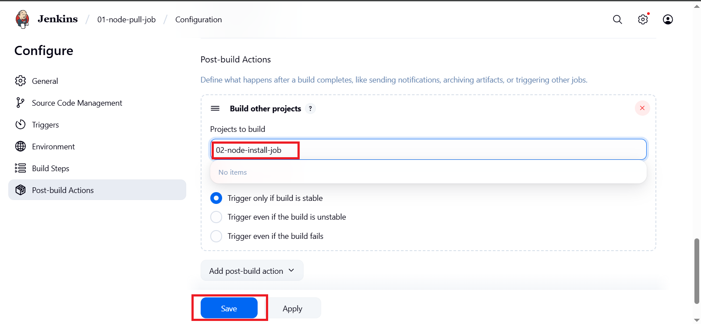

# 🚀Complete Guide: Node.js Deployment on Jenkins Using Freestyle Projects 
## Complete Guide: Node.js Deployment on Jenkins Using Freestyle Projects
Automating your Node.js application deployment with Jenkins helps you deliver updates quickly, reliably, and consistently. This tutorial will walk you through setting up Jenkins freestyle projects to pull your code from GitHub, install dependencies, and deploy your Node.js app using PM2.

---
## Prerequisites
- Before you start, make sure you have the following in place:

- A Linux server (Ubuntu/Debian recommended) with Jenkins installed and running. Jenkins runs as a dedicated user (jenkins).

- Jenkins user has sudo privileges so it can install software and manage processes.

- Git plugin installed in Jenkins (usually pre-installed).

- Node.js application source code hosted on a Git repository (e.g., GitHub).

- Open Jenkins web UI port (default 8080) accessible via your firewall/security groups.

- Open your Node.js application port (e.g., 3000) in firewall/security group to allow external access.

---
### System Setup: Installing Node.js and PM2 for Jenkins User
#### 1. Switch to the Jenkins User
Jenkins jobs run under the jenkins user account. You need to install Node.js and PM2 as this user:
```
sudo su - jenkins
```
#### 2. Update Package Lists
Always start by updating your package lists:
```
sudo apt update
```
### 3. Add Node.js LTS Repository
Add the Node.js LTS repository maintained by NodeSource:
```
sudo curl -fsSL https://deb.nodesource.com/setup_lts.x | bash -
```
### 4. Install Node.js
Install Node.js and npm from the added repository:
```
sudo apt-get update
sudo apt install -y nodejs
```
### 5. Verify Node.js and npm Installation
Check versions to confirm successful installation:
```
node -v
npm -v
```
### 6. Install PM2 Globally
PM2 is a process manager to keep your Node.js app running and manage restarts:
```
sudo npm install -g pm2
```
Verify PM2 installation:
```
pm2 -v

```
---

### Setting Up Jenkins Freestyle Projects
We will create three Jenkins freestyle jobs to automate the deployment pipeline:

01-node-pull-job: Pull latest source code from Git.

02-node-install-job: Install Node.js dependencies (npm install).


03-node-deploy-job: Deploy/start the Node.js application using PM2.


Project 1: 01-node-pull-job

---
### Open Jenkins web interface.

Click New Item.

Enter name: 01-node-pull-job.

Choose Freestyle project, click OK.


Scroll to Source Code Management, select Git.




Enter your Git repository URL, e.g.:
https://github.com/iamtruptimane/node-js-app-CICD.git

Under Build Triggers, optionally configure how and when to trigger builds.

Scroll to Post-build Actions.

Select Build other projects.


Enter 02-node-install-job as the downstream job.




Click Save.


