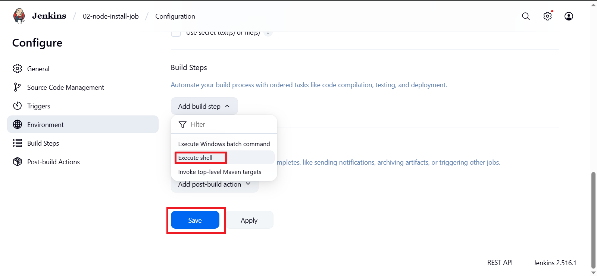

# 🚀Complete Guide: Node.js Deployment on Jenkins Using Freestyle Projects 

Automating your Node.js application deployment with Jenkins helps you deliver updates quickly, reliably, and consistently. This tutorial will walk you through setting up Jenkins freestyle projects to pull your code from GitHub, install dependencies, and deploy your Node.js app using PM2.

---

## Architecture Diagram 


- Jenkins acts as the orchestrator, running the pipeline jobs.

- The GitHub repo hosts your Node.js application code.

- PM2 ensures your app runs continuously and restarts on failure.

- The application is accessible externally on port 3000.


---
## Prerequisites

- Before you start, make sure you have the following in place:

- A Linux server (Ubuntu/Debian recommended) with Jenkins installed and running. Jenkins runs as a dedicated user (jenkins).

- Jenkins user has sudo privileges so it can install software and manage processes.

- Git plugin installed in Jenkins (usually pre-installed).

- Node.js application source code hosted on a Git repository (e.g., GitHub).

- Open Jenkins web UI port (default 8080) accessible via your firewall/security groups.

- Open your Node.js application port (e.g., 3000) in firewall/security group to allow external access.

---
### System Setup: Installing Node.js and PM2 for Jenkins User
#### 1. Switch to the Jenkins User
Jenkins jobs run under the jenkins user account.

- You need to install Node.js and PM2 as this user:
```
sudo su - jenkins
```
#### 2. Update Package Lists
- Always start by updating your package lists:
```
sudo apt update
```
### 3. Add Node.js LTS Repository
- Add the Node.js LTS repository maintained by NodeSource:
```
sudo curl -fsSL https://deb.nodesource.com/setup_lts.x | bash -
```
### 4. Install Node.js
- Install Node.js and npm from the added repository:
```
sudo apt-get update
sudo apt install -y nodejs
```
### 5. Verify Node.js and npm Installation
- Check versions to confirm successful installation:
```
node -v
npm -v
```
### 6. Install PM2 Globally
PM2 is a process manager to keep your Node.js app running and manage restarts:
```
sudo npm install -g pm2
```
- Verify PM2 installation:
```
pm2 -v

```
---

### Setting Up Jenkins Freestyle Projects
We will create three Jenkins freestyle jobs to automate the deployment pipeline:

01-node-pull-job: Pull latest source code from Git.

02-node-install-job: Install Node.js dependencies (npm install).

03-node-deploy-job: Deploy/start the Node.js application using PM2.

Project 1: 01-node-pull-job

---
### Open Jenkins web interface.

- Click New Item.

- Enter name: 01-node-pull-job.

- Choose Freestyle project, click OK.


- Scroll to Source Code Management, select Git.


- Enter your Git repository URL, e.g.:
https://github.com/iamtruptimane/node-js-app-CICD.git

- Under Build Triggers, optionally configure how and when to trigger builds.

- Scroll to Post-build Actions.

- Select Build other projects.


- Enter 02-node-install-job as the downstream job.


- Click Save.

### Project 2: 02-node-install-job
Create a new freestyle project named 02-node-install-job.

- Click OK.


- Add a Build Step → Execute Shell.



- Enter the shell script
```
cd /var/lib/jenkins/workspace/01-node-pull-job
sudo npm install
```
Explanation: This moves to the workspace where the code was pulled and installs all dependencies listed in package.json.


- Scroll to Post-build Actions.

- Select Build other projects.

- Enter 03-node-deploy-job.

- Click Save.


---
## Project 3: 03-node-deploy-job

- Create a new freestyle project named 03-node-deploy-job.

- Click OK.


- Add a Build Step → Execute Shell.


- Enter the shell script:

```
cd /var/lib/jenkins/workspace/02-node-install-job

sudo pm2 start app.js || pm2 restart app.js
```
Explanation: This navigates to the workspace and starts the Node.js app using PM2. 

If it’s already running, it restarts it to reflect the new code.

- Click Save.

---
### Running the Pipeline
- Go to Jenkins dashboard.

- Click on 01-node-pull-job.

- Click Build Now.

- This will trigger the downstream jobs in order:

- 01-node-pull-job (pull code),

- then 02-node-install-job (install dependencies),

- then 03-node-deploy-job (deploy app).

---
### Open Your Application Port
Make sure port 3000 (or the port your Node.js app listens on) is open in your server’s firewall or cloud security group:

- For AWS Security Group:

- Type: Custom TCP

- Port Range: 3000

- Source: Anywhere (0.0.0.0/0) or your IP range

---
### Access the Application
Open your browser and go to:
```
http:http://3.95.238.208:3000/

```
You should see your Node.js application running!


---
### Conclusion
By setting up Node.js deployment on Jenkins using freestyle projects, you’ve built a simple yet effective CI/CD pipeline that automates pulling code from a repository, installing dependencies, and deploying the application with PM2.

This approach not only saves time but also reduces human errors, ensuring your application is always up-to-date and running smoothly. While freestyle projects are great for getting started, you can later upgrade to Jenkins Pipeline as Code for more flexibility, scalability, and better maintainability.

With the right automation in place, you can focus more on building features and less on managing deployments — turning ideas into running applications faster than ever! 

---